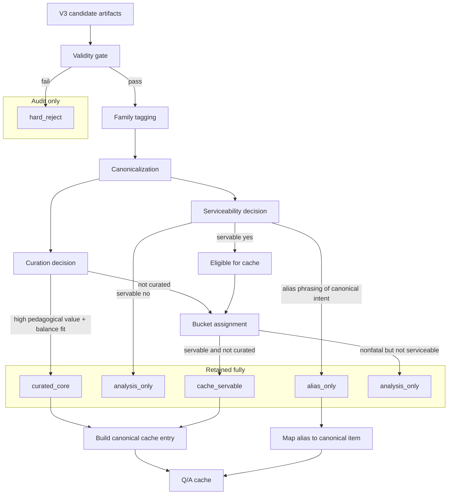

# Question Generation V4 — Mermaid Policy Diagram

## Notes

- `curated_core` and `cache_servable` can create active cache entries.
- `alias_only` should usually route to a canonical cache item rather than become its own served record.
- `analysis_only` is quarantined for tuning and reviewer workflows.
- `hard_reject` stores minimal audit metadata only.
