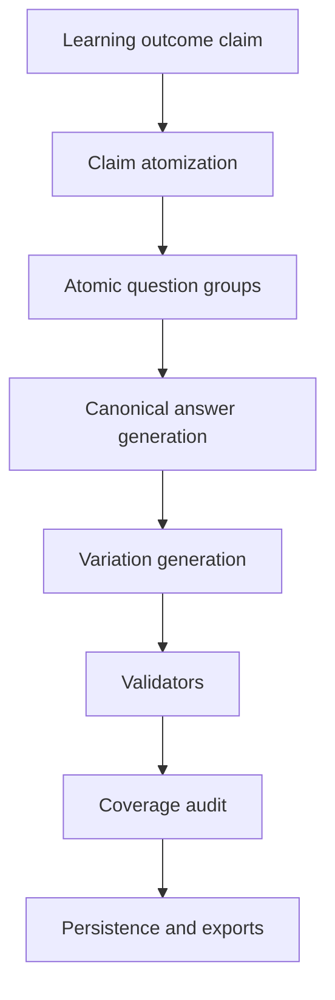

# Pipeline Memo

This memo is now a short companion to the canonical specs:

- [project_spec.md](/code/docs/project_spec.md)
- [question_generation_algorithm_spec.md](/code/docs/question_generation_algorithm_spec.md)

Use those two docs as the primary current references.

## Purpose

This memo remains useful as a compact summary of pipeline layers and their
responsibilities.

## Current Shape

The system is no longer a single monolithic extraction flow.

It currently has three layers:

1. deterministic course standardization
2. bounded cited learning-outcome extraction
3. bounded staged question-cache generation built on learning outcomes

Only the first layer is fully deterministic.
The second and third layers depend on model calls and should still be treated as
evaluation-stage components rather than fully trusted production outputs.

## Stage 1: Deterministic Standardization

This is the foundation of the entire pipeline.

### Inputs

- raw Class Central DataCamp YAML files

### Main behaviors

1. parse each YAML safely
2. normalize core metadata
3. infer a stable `course_id`
4. recover chapter structure
5. persist normalized records
6. export standardized artifacts

### Field normalization

The standardizer normalizes:

- `course_id`
- `provider`
- `subjects`
- `level`
- `duration_hours`
- `pricing`
- `language`
- `ratings`
- `details`

### Chapter recovery

Chapter handling follows this order:

1. if `syllabus` exists, use it directly
2. otherwise infer chapters from `overview`
3. mark inferred chapters as `overview_inferred`
4. assign lower confidence to inferred chapter structure

### Persistence

The deterministic layer persists:

- `extraction_runs`
- `source_files`
- `courses`
- `chapters`

### Exports

The deterministic layer exports:

- `courses.jsonl`
- `chapters.jsonl`
- `errors.jsonl`
- `standardized_courses/<course_id>.yaml`

### Relevant implementation

- [normalize.py](/code/src/course_pipeline/normalize.py:1)
- [schemas.py](/code/src/course_pipeline/schemas.py:1)
- [storage.py](/code/src/course_pipeline/storage.py:1)
- [pipeline.py](/code/src/course_pipeline/pipeline.py:1)

## Stage 2: Learning-Outcome Extraction

This layer takes normalized courses and produces cited learning-outcome claims.

It is the current semantic substrate for later cache work.

### Inputs

- normalized course fields
- recovered chapter structure
- YAML-derived citations

### Main behaviors

1. prepare a reduced prompt payload from course data
2. ask the model for likely learning outcomes
3. require explicit citations
4. reject unsupported citation fields
5. downgrade confidence when evidence is course-level only
6. export both JSONL and per-course YAML inspection artifacts

### Important constraint

This layer does **not** claim to infer actual learner performance.
It only infers what a reasonably successful student would likely learn from the
course as described in the YAML.

### Persistence

This layer persists:

- `learning_outcome_extractions`

### Exports

This layer exports:

- `learning_outcomes.jsonl`
- `learning_outcome_errors.jsonl`
- `learning_outcomes_yaml/<course_id>.yaml`

### Operational status

This layer is real and usable for bounded review.
It is not yet a fully trusted production semantic layer.

### Relevant implementation

- [learning.py](/code/src/course_pipeline/learning.py:1)
- [pipeline.py](/code/src/course_pipeline/pipeline.py:1)
- [inspect_learning.py](/code/src/course_pipeline/inspect_learning.py:1)

## Stage 3: Staged Question-Cache Generation

This layer is built on top of learning outcomes.

Its purpose is to create a traceable fast-path cache of common learner
questions and reusable short answers.

The lineage target is:

`course -> claim -> question_group -> variation -> canonical_answer`

### Inputs

- learning-outcome extractions
- claim text
- claim citations

### Current staged flow

This layer now uses an explicit staged flow rather than a one-shot generation
step.

This diagram is worth keeping because the distinction between atomization,
answer generation, variation generation, validation, and coverage audit is the
main architectural correction in the current pipeline.

### Stage 3A: Claim atomization

Goal:
- split one claim into atomic learner intents

Current behavior:

1. try model-based atomization first
2. if that underproduces, use a deterministic fallback atomizer
3. assign one `question_group_id` per intent

Current limitation:
- atomization quality is still mixed
- some generated canonical questions are awkward or underspecified

### Stage 3B: Canonical answer generation

Goal:
- generate one short reusable answer per atomic question group

Current behavior:

1. generate one answer per group
2. keep answers short and direct
3. keep citation linkage from the source claim

Current limitation:
- many answers still fail answer-fit validation

### Stage 3C: Variation generation

Goal:
- generate only strict same-answer paraphrases

Current behavior:

1. canonical question is always included as a variation anchor
2. additional candidate variations are generated after the answer exists
3. each variation records validation state and runtime eligibility

Current limitation:
- the current run still tends toward undergeneration
- the pipeline is now intentionally conservative rather than permissive

### Stage 3D: Validators

The pipeline now includes explicit validation state rather than relying on
implicit failure through missing rows.

Current validator types:

1. answer-fit
2. grounding
3. coverage audit
4. variation same-answer status, represented as accepted vs not accepted

Validator outputs are logged and exported.

### Stage 3E: Coverage audit

Every claim must now be accounted for.

A claim ends in one of two states:

1. produced at least one question group
2. produced no groups, but has an explicit audit reason

This prevents silent disappearance of claim coverage.

### Persistence

The question-cache layer persists:

- `claim_question_groups`
- `question_group_variations`
- `canonical_answers`
- `question_cache_match_logs`

## Current Canonical Question Path

The currently preferred question path is no longer the older claim-to-cache
path alone.

The operational question pipeline in this repo is:

`normalized course -> V3 generation -> V4.1 policy -> V6 ledger -> inspection bundle`

For the full current logic, including foundational beginner-definition rules,
see [question_generation_algorithm_spec.md](/code/docs/question_generation_algorithm_spec.md).
- `question_cache_fallback_logs`
- `question_cache_validation_logs`
- `claim_coverage_audit`

### Exports

The question-cache layer exports:

- `claim_question_groups.jsonl`
- `question_group_variations.jsonl`
- `canonical_answers.jsonl`
- `question_cache_validation_logs.jsonl`
- `claim_coverage_audit.jsonl`
- `question_cache_errors.jsonl`
- `question_cache_yaml/<course_id>.yaml`

### Runtime path

There is now a first runtime cache matcher.

Current policy:

1. normalize incoming question text
2. bypass cache for obvious repair or follow-up style requests
3. try exact or lexical matching against runtime-eligible variations
4. only return a hit when score and margin are sufficient
5. otherwise log a fallback path

This remains a bounded first matcher, not a full adaptive tutoring runtime.

### Relevant implementation

- [question_cache.py](/code/src/course_pipeline/question_cache.py:1)
- [pipeline.py](/code/src/course_pipeline/pipeline.py:1)
- [inspect_question_cache.py](/code/src/course_pipeline/inspect_question_cache.py:1)

## Current CLI Surface

The current CLI exposes these major operations:

### Deterministic layer

- `init-db`
- `ingest`
- `export-standardized`

### Learning-outcome layer

- `run-learning-outcomes`
- `inspect-learning-run`
- `render-learning-yaml`

### Question-cache layer

- `build-question-cache`
- `render-question-cache-yaml`
- `inspect-question-cache-run`
- `ask-question-cache`
- `replay-question-cache-eval`
- `validate-question-cache`
- `audit-question-cache-coverage`

Primary entrypoint:
- [cli.py](/code/src/course_pipeline/cli.py:1)

## What Is Operationally Strong

The following parts are now structurally solid:

1. deterministic normalization and chapter recovery
2. run tracking and persistence
3. per-run JSONL exports
4. per-course YAML inspection exports
5. cited learning-outcome extraction as a bounded substrate
6. staged question-cache pipeline with validation and coverage audit

## What Is Still Experiment-Grade

The following parts should still be treated as bounded-review components:

1. learning-outcome quality calibration
2. question-group atomization quality
3. answer-fit quality
4. grounding strictness
5. runtime cache usefulness beyond bounded fixtures

## Most Important Current Weakness

The main remaining weakness is not plumbing.
It is semantic quality.

In current staged question-cache runs:

- coverage is now complete
- validation is explicit
- runtime gating is possible

But:

- many canonical questions are still poor
- many generated answers fail answer-fit
- some answers still fail grounding

That means the architecture is ahead of the content quality.

## Full-Corpus Status

At the time of writing:

1. the deterministic layer can run on the full corpus
2. the semantic layers have mostly been exercised on bounded slices
3. a true full-corpus learning-outcome run was launched under:
   - [20260414T052429Z](/code/data/pipeline_runs/20260414T052429Z)
4. that run was still in progress during the current working session

This matters because the semantic pipeline should not be described as
full-corpus complete unless the run artifacts confirm completion.

## Recommended Reading Order

For a reviewer who wants to inspect the pipeline quickly:

1. [status-1.md](/code/docs/status-1.md:1)
2. [question_cache_pipeline_review_report.md](/code/docs/question_cache_pipeline_review_report.md:1)
3. [7630 learning outcomes](/code/data/pipeline_runs/20260414T025608Z/learning_outcomes_yaml/7630.yaml:1)
4. [7630 staged question cache](/code/data/pipeline_runs/20260414T044551Z/question_cache_yaml/7630.yaml:1)

## Bottom Line

The repository now contains:

1. a deterministic course standardizer
2. a bounded cited learning-outcome extractor
3. a bounded staged question-cache pipeline with validation and coverage audit

The first layer is reliable.
The second and third layers are structurally credible and inspectable, but still
need quality refinement before they should be treated as broadly trusted runtime
systems.
