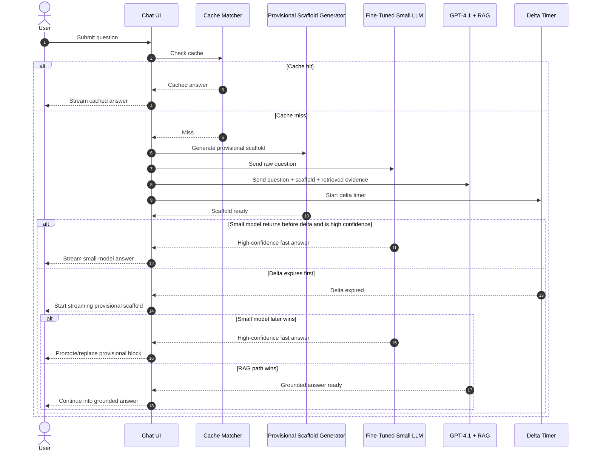

# Engineering Memo: Provisional Response Serving on Cache Miss

## Status
Draft

## Owner
OpenAI / ChatGPT working draft

## Purpose
This memo proposes a runtime serving approach for handling cache misses in a bounded tutoring or question-answering system. The goal is to reduce perceived latency after question submission while preserving trust, answer quality, and inspectability.

The proposed design treats an ELIZA-like response as a **provisional scaffold**, not as an authoritative answer.

---

## Background
A cache miss creates a dead zone between user intent and the first visible sign of progress. That gap is especially harmful in early-turn interactions, where perceived responsiveness strongly affects whether the system feels competent or sluggish.

At the same time, superficial UX tricks can backfire. If interim text feels manipulative, content-free, or later gets contradicted, the product can feel less trustworthy rather than more responsive. The design objective is therefore not to "make it look busy," but to provide immediate, low-risk value while the authoritative answer is being prepared.

This fits the current repo direction: bounded serving, explicit cache paths, runtime fallback logging, and an evidence-first / inspection-first architecture rather than an unrestricted generic chatbot.

---

## Problem Statement
On a cache miss, the current experience risks three undesirable outcomes:

1. **Visible silence** while the full model pipeline runs
2. **Slow first feedback** even when the system already has a good guess about user intent
3. **Trust erosion** if interim content is theatrical rather than useful

We want a miss path that:

- improves time to first visible response
- improves time to first useful response
- preserves answer quality and grounding
- remains inspectable in logs and runtime artifacts

---

## Proposal
On cache miss, the system should fork into three concurrent lanes:

1. **Small-model fast path**
   - send raw user question to a fine-tuned small LLM
   - attempt a short, high-confidence answer quickly

2. **Grounded large-model path**
   - send question + provisional scaffold + retrieved evidence to a stronger model such as GPT-4.1 with RAG
   - generate the authoritative answer

3. **Provisional rendering path**
   - wait a short delta window
   - if no high-confidence fast-path winner emerges, begin streaming a provisional scaffold

The provisional scaffold is an ELIZA-like conversational layer whose purpose is to acknowledge the request, interpret the task, and give immediate structure while the final answer is being prepared.

The scaffold is **not** the answer.

---

## Proposed Runtime Flow

1. User submits question.
2. Runtime cache matcher checks for a cache-served answer.
3. If cache hit, stream cached answer immediately.
4. If cache miss:
   - generate provisional scaffold
   - send raw question to small model
   - send question + provisional scaffold + retrieved evidence to large model
   - start delta timer
5. If the small model returns before delta expires and clears a strict confidence threshold, stream the small-model answer directly.
6. Otherwise, when delta expires, begin streaming the provisional scaffold.
7. If the small model later returns with sufficient confidence, promote it to the visible answer.
8. If the small model does not win, continue from the scaffold into the grounded large-model answer.

---

## Design Principle
The UX should follow this pattern:

**provisional scaffold -> authoritative answer**

not:

**fake answer -> erase -> real answer**

The UI should make the provisional layer visually and behaviorally distinct.

Recommended transitions:

- keep the provisional scaffold as a brief interpretation line and continue with the authoritative answer
- replace the provisional block cleanly with the small-model answer
- continue naturally from scaffold into grounded answer

Literal backspacing or theatrical deletion should be treated as experimental and only used if testing shows that users find it natural rather than manipulative.

---

## What the Provisional Scaffold Should Do
The scaffold should be constrained to a small set of safe behaviors:

- acknowledge likely intent
- restate the task
- preview answer structure
- provide one very safe framing sentence when confidence is high

### Good examples

- "So you're asking about how X differs from Y."
- "I'm checking this as definition, comparison, and when to use each."
- "Quick structure: what it is, why it matters, then an example."

### Bad examples

- invented factual claims
- long explanatory content that may later be contradicted
- vague filler such as "Interesting question..."
- fake typing or content with no informational value

---

## Confidence Gating
The small model should only take over the answer stream if all of the following are true:

- confidence exceeds threshold
- answer is short and stable
- domain risk is acceptable
- retrieval or evidence support is sufficient when required
- no contradiction with known retrieved evidence is detected

A practical policy is:

- **promote** when answer is high-confidence and low-risk
- **discard quietly** when confidence is weak or ambiguity is high

---

## Prompting Guidance
The large-model grounded path should not treat the provisional scaffold as truth.

Instead, it should receive the scaffold as a tentative interpretation, for example:

```text
provisional_interpretation:
- user may be asking about ...
- use only if consistent with retrieved evidence
- discard if evidence disagrees
```

This prevents the scaffold from anchoring the larger model in the wrong direction.

---

## Runtime State Model
Suggested states:

- `CACHE_HIT`
- `CACHE_MISS`
- `PROVISIONAL_PENDING`
- `PROVISIONAL_VISIBLE`
- `SMALL_MODEL_PROMOTED`
- `RAG_MODEL_TAKEOVER`
- `FINAL_ANSWER_STREAMING`

The implementation should explicitly log transitions between these states.

---

## Sequence Diagram



---

## Timing Diagram

```mermaid
gantt
    title Cache Miss Response Orchestration
    dateFormat  X
    axisFormat %Lms

    section Request
    User submits question          :milestone, m1, 0, 0
    Cache lookup                   :a1, 0, 80

    section Miss Handling
    Generate provisional scaffold  :a2, 80, 180
    Start small model              :a3, 80, 500
    Start GPT-4.1 + RAG            :a4, 80, 1800
    Delta wait window              :crit, a5, 80, 350

    section Visible UX
    Hold UI before scaffold        :a6, 80, 350
    Stream provisional scaffold    :a7, 350, 500

    section Fast Path Outcome
    Small model high-confidence    :milestone, m2, 260, 0
    Promote small-model answer     :a8, 260, 600

    section Slow Path Outcome
    RAG first grounded tokens      :milestone, m3, 900, 0
    Continue into grounded answer  :a9, 900, 1800
```



---

## Logging and Inspectability
To fit the current evidence-first and inspection-first architecture, the miss path should produce explicit runtime artifacts.

Suggested runtime fields:

- `request_id`
- `cache_result` (`hit`, `miss`, `near_hit`)
- `provisional_scaffold_text`
- `provisional_shown` (bool)
- `small_model_confidence`
- `small_model_promoted` (bool)
- `authoritative_answer_source` (`cache`, `small_model`, `rag_model`)
- `time_to_first_visible_ms`
- `time_to_first_useful_ms`
- `time_to_final_answer_ms`
- `contradiction_flag`
- `fallback_reason`

This keeps the system aligned with non-destructive inspection and explicit runtime behavior rather than silent, ad hoc UI tricks.

---

## Risks

### 1. Trust Risk
If the scaffold is too chatty, too vague, or later contradicted, users may see it as manipulative.

### 2. Orchestration Overhead
The miss path adds concurrency, timing gates, and coordination logic. If not implemented carefully, orchestration overhead can erase the latency benefit.

### 3. Small-Model Overreach
A fast incorrect answer can be worse than a slower correct one. Confidence gating must be strict.

### 4. Prompt Anchoring
If the provisional scaffold is fed to the large model as fact rather than tentative interpretation, it can bias the final answer incorrectly.

### 5. UX Complexity
Backspacing, overwriting, and handoff effects can look clever in demos but feel unstable in real use.

---

## Metrics
This approach should be evaluated on both responsiveness and trust.

Primary metrics:

- time to first visible response
- time to first useful response
- time to final answer
- first-turn abandonment
- second-turn abandonment
- follow-up rate
- correction rate
- user satisfaction / trust indicators

The main goal is not to make the system look busy. The goal is to improve early perceived competence without damaging correctness or trust.

---

## Recommendation
Implement this as a **speculative serving layer with progressive fallback**.

Core rule:

> On cache miss, create a provisional scaffold and fork execution into a fast small-model lane and a grounded large-model lane. Delay visible fallback briefly to let the fast path win. If no high-confidence fast answer emerges, render the provisional scaffold as a low-risk, useful interim layer, then transition to the authoritative answer when available.

This preserves the main benefit of the ELIZA idea — immediate conversational progress — without turning the system into empty latency theater.

---

## References

- `Chatbot Abandonment Hypothesis.txt`
- `project_spec.md`
- `pipeline_memo.md`
- prior working notes on speculative serving, progressive rendering, and bounded cache-first QA
