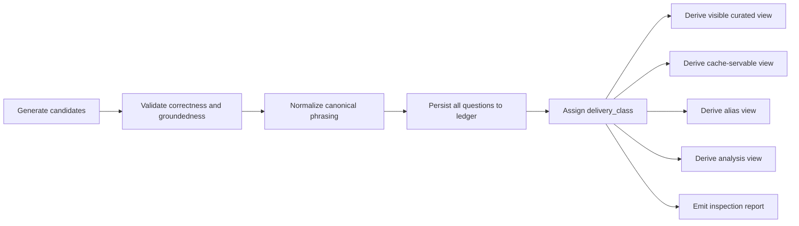
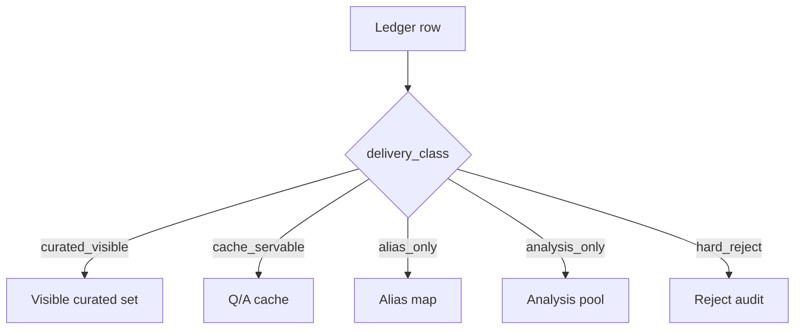

# Question Ledger V6 Diagram

```mermaid
flowchart LR
    A[Generate candidates] --> B[Validate correctness and groundedness]
    B --> C[Normalize canonical phrasing]
    C --> D[Persist all questions to ledger]
    D --> E[Assign delivery_class]
    E --> F[Derive visible curated view]
    E --> G[Derive cache-servable view]
    E --> H[Derive alias view]
    E --> I[Derive analysis view]
    E --> J[Emit inspection report]
```

```mermaid
flowchart TD
    A[Ledger row] --> B{delivery_class}
    B -->|curated_visible| C[Visible curated set]
    B -->|cache_servable| D[Q/A cache]
    B -->|alias_only| E[Alias map]
    B -->|analysis_only| F[Analysis pool]
    B -->|hard_reject| G[Reject audit]
```
