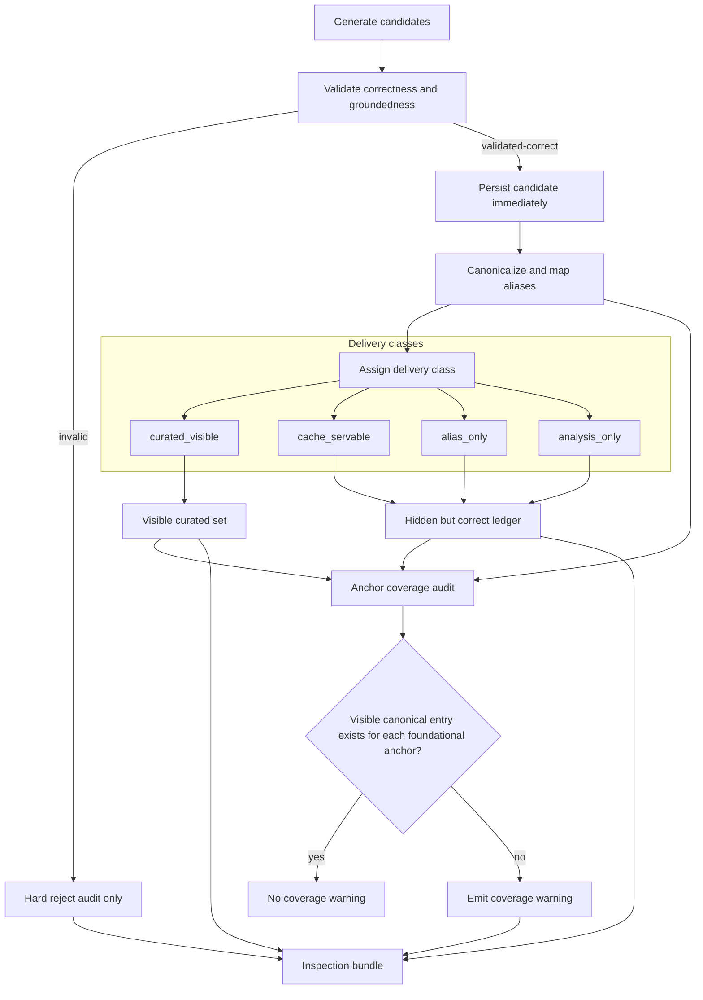

# Question Generation V4.1 — Mermaid Diagram

```mermaid
flowchart TD
    A[Generate candidates] --> B[Validate correctness and groundedness]

    B -->|invalid| R[Hard reject audit only]
    B -->|validated-correct| C[Persist candidate immediately]

    C --> D[Canonicalize and map aliases]
    D --> E[Assign delivery class]

    subgraph E1 [Delivery classes]
        E --> E2[curated_visible]
        E --> E3[cache_servable]
        E --> E4[alias_only]
        E --> E5[analysis_only]
    end

    E2 --> F[Visible curated set]
    E3 --> G[Hidden but correct ledger]
    E4 --> G
    E5 --> G

    D --> H[Anchor coverage audit]
    F --> H
    G --> H

    H --> I{Visible canonical entry exists for each foundational anchor?}
    I -->|yes| J[No coverage warning]
    I -->|no| K[Emit coverage warning]

    F --> L[Inspection bundle]
    G --> L
    K --> L
    R --> L
```
