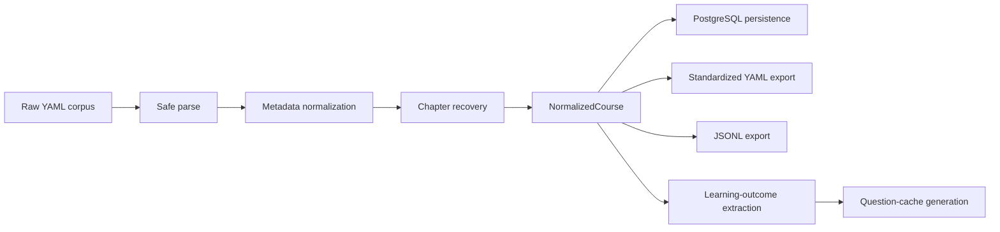
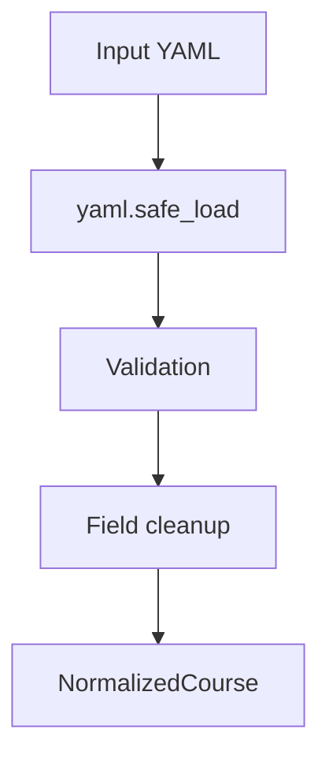
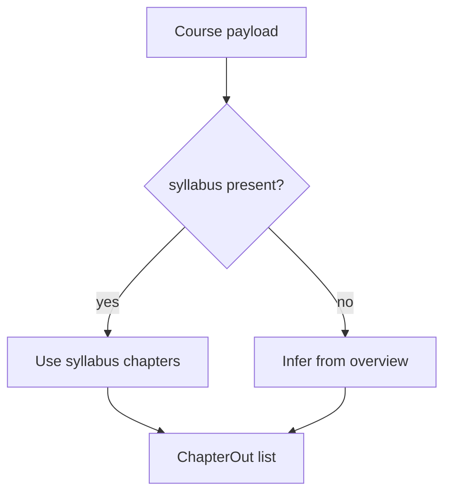
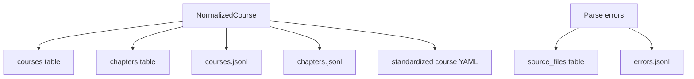
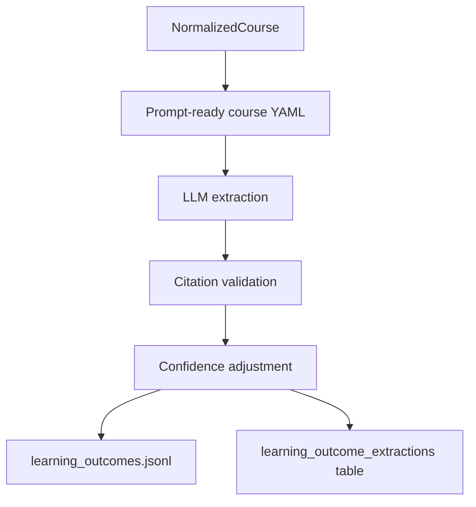
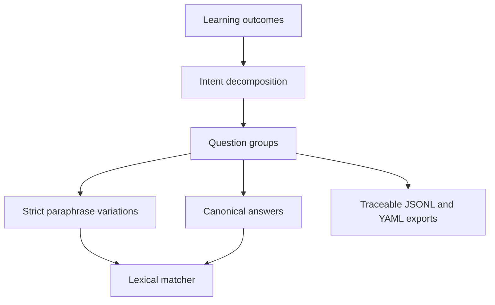

# Status 1

## Summary

The project is now a deterministic standardization pipeline with two bounded
semantic extensions:

1. cited learning-outcome extraction
2. traceable question-cache generation on top of those learning outcomes

Current boundary:

1. Read raw course YAML.
2. Normalize it into a typed course schema.
3. Recover chapter structure deterministically.
4. Persist normalized courses and chapters to PostgreSQL.
5. Export standardized YAML and JSONL artifacts.
6. Optionally run a bounded cited learning-outcome pass for inspection.
7. Optionally build a bounded question-cache layer from those claims.

Everything after that boundary has been removed.

## What Exists Now

Implemented components:

1. Safe corpus ingestion for the Class Central DataCamp YAML directory.
2. Field normalization for:
   1. `course_id`
   2. `provider`
   3. `subjects`
   4. `level`
   5. `duration_hours`
   6. `pricing`
   7. `language`
   8. `ratings`
   9. `details`
3. Chapter recovery from:
   1. structured `syllabus`
   2. inferred `overview` segments when `syllabus` is missing
4. PostgreSQL storage for:
   1. `extraction_runs`
   2. `source_files`
   3. `courses`
   4. `chapters`
5. Export of:
   1. `courses.jsonl`
   2. `chapters.jsonl`
   3. `errors.jsonl`
   4. `standardized_courses/<course_id>.yaml`
6. Bounded semantic extraction of:
   1. `learning_outcomes.jsonl`
   2. `learning_outcome_errors.jsonl`
7. Bounded cache extraction of:
   1. `claim_question_groups.jsonl`
   2. `question_group_variations.jsonl`
   3. `canonical_answers.jsonl`
   4. `question_cache_yaml/<course_id>.yaml`

## Pipeline



## Transformations

### 1. Raw file to normalized course



1. Parse each YAML file safely.
2. Reject malformed or unusable records without stopping the batch.
3. Normalize metadata into a single `NormalizedCourse` object.
4. Preserve raw provenance through `raw_yaml_path`.

### 2. Raw structure to standardized chapters



1. Use `syllabus` chapter order directly when available.
2. If `syllabus` is empty, infer chapter boundaries from `overview`.
3. Mark chapter source as either `syllabus` or `overview_inferred`.
4. Lower confidence for inferred chapter structure.

### 3. Normalized records to persisted outputs



1. Create a run record in `extraction_runs`.
2. Record source-file parse status in `source_files`.
3. Upsert normalized course rows into `courses`.
4. Upsert chapter rows into `chapters`.
5. Write course-level JSONL export.
6. Write chapter-level JSONL export.
7. Write one standardized YAML file per course.
8. Write parse errors to `errors.jsonl`.

### 4. Normalized course to cited learning outcomes



1. Build a reduced prompt payload from normalized course fields.
2. Run a bounded prompt that infers likely learning outcomes only.
3. Require every outcome to include reasoning and explicit YAML citations.
4. Reject unsupported citation fields.
5. Downgrade confidence when only course-level evidence is available.
6. Reject syllabus citations for courses without a real syllabus.

### 5. Learning outcomes to traceable question cache



1. Consume cited learning outcomes as the source substrate.
2. Decompose each claim into distinct learner intents.
3. Generate one question group per intent.
4. Generate only strict paraphrase variations within each group.
5. Generate one short canonical answer per group.
6. Preserve lineage:
   `course -> claim -> question_group -> variation -> canonical_answer`.
7. Validate group boundaries conservatively before persistence.
8. Support a first cache runtime with deterministic normalization, lexical
   matching, and LLM fallback on misses or repair-style questions.

## Code Paths

If you want to inspect the implementation, the active files are:

1. [src/course_pipeline/normalize.py](/code/src/course_pipeline/normalize.py:1)
   Handles parsing, metadata normalization, and chapter recovery.
2. [src/course_pipeline/schemas.py](/code/src/course_pipeline/schemas.py:1)
   Defines `NormalizedCourse` and `ChapterOut`.
3. [src/course_pipeline/storage.py](/code/src/course_pipeline/storage.py:1)
   Defines the reduced PostgreSQL schema and persistence logic.
4. [src/course_pipeline/pipeline.py](/code/src/course_pipeline/pipeline.py:1)
   Runs ingestion and standardized export.
5. [src/course_pipeline/cli.py](/code/src/course_pipeline/cli.py:1)
   Exposes `init-db`, `ingest`, `export-standardized`,
   `run-learning-outcomes`, and `inspect-learning-run`.
6. [src/course_pipeline/learning.py](/code/src/course_pipeline/learning.py:1)
   Runs the cited learning-outcome extraction and validation logic.
7. [src/course_pipeline/inspect_learning.py](/code/src/course_pipeline/inspect_learning.py:1)
   Provides the terminal inspector for learning-outcome runs.
8. [src/course_pipeline/question_cache.py](/code/src/course_pipeline/question_cache.py:1)
   Handles cache generation, validation, matching, and fallback.
9. [src/course_pipeline/inspect_question_cache.py](/code/src/course_pipeline/inspect_question_cache.py:1)
   Provides the terminal inspector for question-cache runs.

## How To Examine It

Use these commands:

```bash
course-pipeline init-db
course-pipeline export-standardized data/classcentral-datacamp-yaml
```

Then inspect:

1. `data/pipeline_runs/<run_id>/courses.jsonl`
2. `data/pipeline_runs/<run_id>/chapters.jsonl`
3. `data/pipeline_runs/<run_id>/errors.jsonl`
4. `data/pipeline_runs/<run_id>/standardized_courses/`

For a semantic run, also inspect:

5. `data/pipeline_runs/<run_id>/learning_outcomes.jsonl`
6. `data/pipeline_runs/<run_id>/learning_outcome_errors.jsonl`

For a question-cache run, inspect:

7. `data/pipeline_runs/<run_id>/claim_question_groups.jsonl`
8. `data/pipeline_runs/<run_id>/question_group_variations.jsonl`
9. `data/pipeline_runs/<run_id>/canonical_answers.jsonl`
10. `data/pipeline_runs/<run_id>/question_cache_errors.jsonl`
11. `data/pipeline_runs/<run_id>/question_cache_yaml/`

## Explicitly Removed

These layers are no longer part of the system:

1. topic extraction
2. edge extraction
3. pedagogical profiling
4. question generation
5. graph-oriented persistence
6. eval-pack generation
7. the old multi-artifact extraction TUI
8. embedding-based semantic cache matching

## Bottom Line

This repo now contains a deterministic course standardizer, a narrow cited
learning-outcome extractor, and a bounded traceable question-cache layer. It is
still not a topic-graph or question-prediction system.
