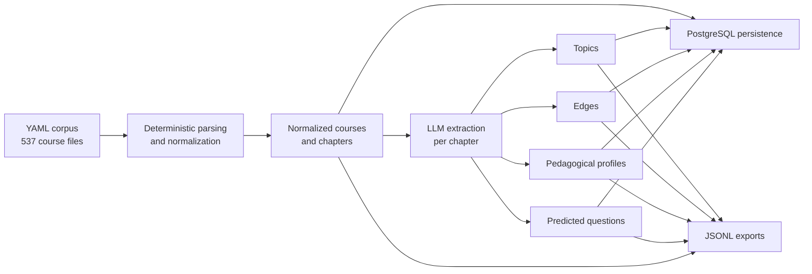
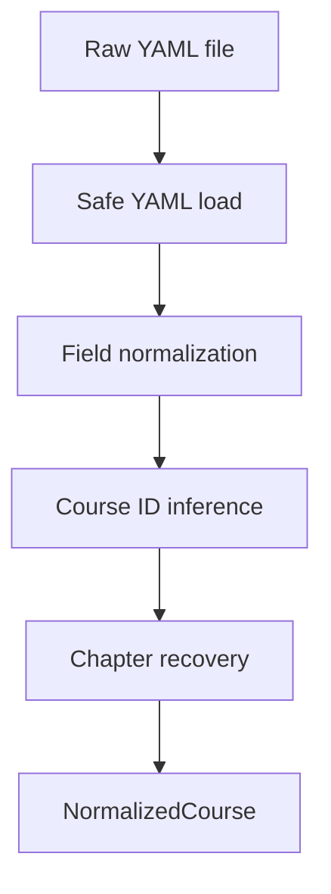
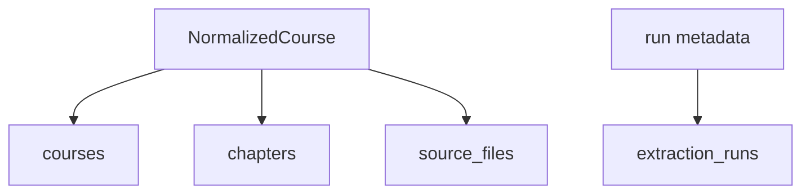
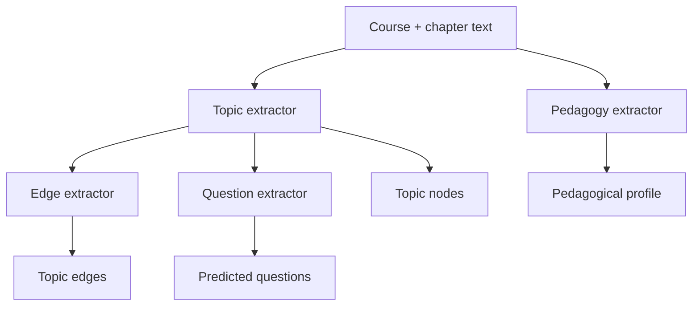
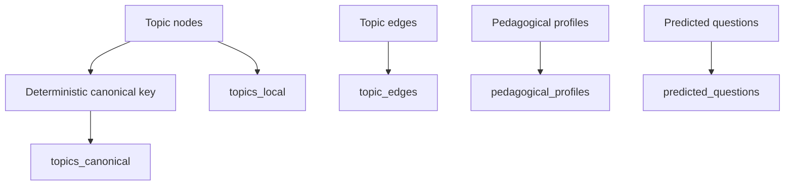
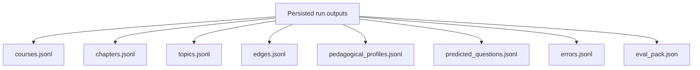

# Status 1

## Current State

The project has moved beyond planning and now has a working first-milestone
pipeline for the Class Central DataCamp YAML corpus.

What is accomplished so far:

1. A Python package and CLI are in place for database initialization, corpus
   ingestion, bounded first-milestone runs, evaluation-pack export, and run
   inspection.
2. Deterministic normalization is implemented for YAML parsing, metadata
   cleanup, duration parsing, level normalization, and chapter recovery.
3. PostgreSQL persistence is implemented for run tracking, source-file status,
   normalized courses and chapters, local topics, canonical topic keys, edges,
   pedagogical profiles, and predicted questions.
4. Typed LLM extraction is implemented for topics, edges, pedagogical profiles,
   and likely student questions using structured outputs.
5. Run artifacts are exported as JSONL under `data/pipeline_runs/<run_id>/`.
6. A bounded validation run has already executed end to end and produced usable
   artifacts with zero recorded extraction errors on that slice.

## Accomplished Pipeline

## Transformation Stages

### 1. Source ingestion to normalized course records

1. Load each YAML file safely and keep batch processing running even when a
   file fails validation.
2. Normalize metadata fields such as provider, subjects, level, language, and
   duration workload into a cleaner typed record.
3. Infer `course_id` from the trailing numeric URL segment when available, with
   fallback to the YAML filename stem.
4. Recover chapters directly from `syllabus` when present.
5. Infer pseudo-chapters from `overview` when `syllabus` is empty, and assign
   lower confidence to those inferred chapter boundaries.

### 2. Normalized records to relational storage

1. Create a timestamped extraction run and attach mode metadata such as
   `ingest` or `first_milestone`.
2. Record source-file status so parse successes and parse failures are both
   traceable.
3. Upsert normalized course rows into `courses`.
4. Upsert recovered chapter rows into `chapters`.

### 3. Chapter text to semantic extraction outputs

1. For each selected chapter, build extraction text from the chapter summary,
   or fall back to course overview or summary when needed.
2. Extract teachable topic nodes with typed structured output.
3. Infer chapter-local topic relations from the extracted topic list and source
   text.
4. Estimate pedagogical signals such as modes, misconceptions, sticking points,
   coding burden, math burden, and abstraction level.
5. Generate likely student questions by mastery band and question type.

### 4. Semantic outputs to graph-oriented persistence

1. Derive a deterministic canonical topic key from `topic_type` plus a slugged
   label.
2. Upsert canonical topic rows before attaching chapter-local topic instances.
3. Persist chapter-local topics with their canonical linkage.
4. Persist extracted topic edges without requiring a separate graph database.
5. Persist pedagogical profiles and predicted questions as relational artifacts.

### 5. Persisted outputs to review artifacts

1. Write normalized and extracted artifacts to per-run JSONL files for offline
   inspection.
2. Keep `errors.jsonl` alongside successful outputs so failures remain visible
   without stopping the run.
3. Generate compact evaluation packs for human review on bounded samples.

## Evidence From The Current Run

The latest documented validation run is `20260413T215831Z`.

1. Corpus available for ingestion: 537 YAML files.
2. Validation slice executed: 10 courses and 20 chapters.
3. Exported outputs from that run:
   1. `courses.jsonl`: 10 rows
   2. `chapters.jsonl`: 20 rows
   3. `topics.jsonl`: 92 rows
   4. `edges.jsonl`: 103 rows
   5. `pedagogical_profiles.jsonl`: 20 rows
   6. `predicted_questions.jsonl`: 202 rows
   7. `errors.jsonl`: 0 rows
4. The evaluation conclusion is that the pipeline is operational end to end,
   with the remaining issues concentrated in quality calibration rather than
   basic viability.

## What Is Not Finished Yet

1. Topic precision is still uneven; some extracted labels are too broad for
   strong canonicalization and graph quality.
2. Embedding-based consolidation is deferred because `pgvector` is not yet part
   of the runtime.
3. Production-hardening items such as migrations, resume semantics, tracing,
   and broader regression coverage remain backlog work.
4. The full-corpus LLM extraction run is intentionally deferred until prompt
   quality improves on another bounded validation slice.
