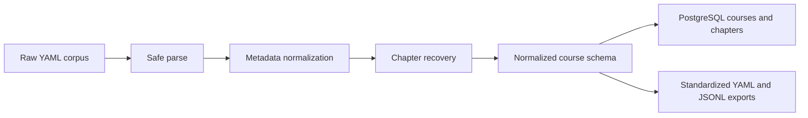

# Status 1

## Current State

The project now stops at deterministic standardization of course records.

Accomplished so far:

1. Safe YAML ingestion is implemented for the Class Central DataCamp corpus.
2. Metadata normalization is implemented for course identifiers, provider,
   subjects, level, duration, language, ratings, and details.
3. Chapter recovery is implemented from `syllabus`, with deterministic fallback
   inference from `overview`.
4. PostgreSQL persistence is limited to run tracking, source-file status,
   normalized courses, and chapters.
5. Standardized course YAML export is implemented per course, alongside JSONL
   course and chapter outputs.

## Standardization Pipeline

## Transformations

### 1. Raw YAML to normalized course schema

1. Load each YAML file safely and keep batch processing running when a file
   fails validation.
2. Normalize provider, subjects, level, duration, language, ratings, and raw
   details into a standardized course object.
3. Infer `course_id` from the trailing numeric segment of `final_url` or
   `source_url`, with fallback to the filename stem.

### 2. Course text to recovered chapter structure

1. Use `syllabus` entries directly when structured chapter data exists.
2. Fall back to deterministic heading and paragraph heuristics on `overview`
   when `syllabus` is empty.
3. Record chapter provenance as `syllabus` or `overview_inferred`.
4. Lower chapter confidence when the structure was inferred rather than given.

### 3. Normalized records to persisted outputs

1. Record the run in `extraction_runs`.
2. Record parse success or failure per source file in `source_files`.
3. Upsert normalized course rows into `courses`.
4. Upsert recovered chapter rows into `chapters`.
5. Export `courses.jsonl`, `chapters.jsonl`, `errors.jsonl`, and
   `standardized_courses/<course_id>.yaml`.

## Scope Removed

Everything after standardized course/chapter output has been cut:

1. No LLM extraction.
2. No topic extraction.
3. No edge extraction.
4. No pedagogical profiling.
5. No question generation.
6. No graph-oriented persistence.
